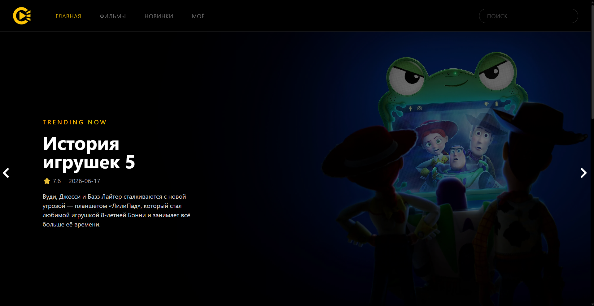
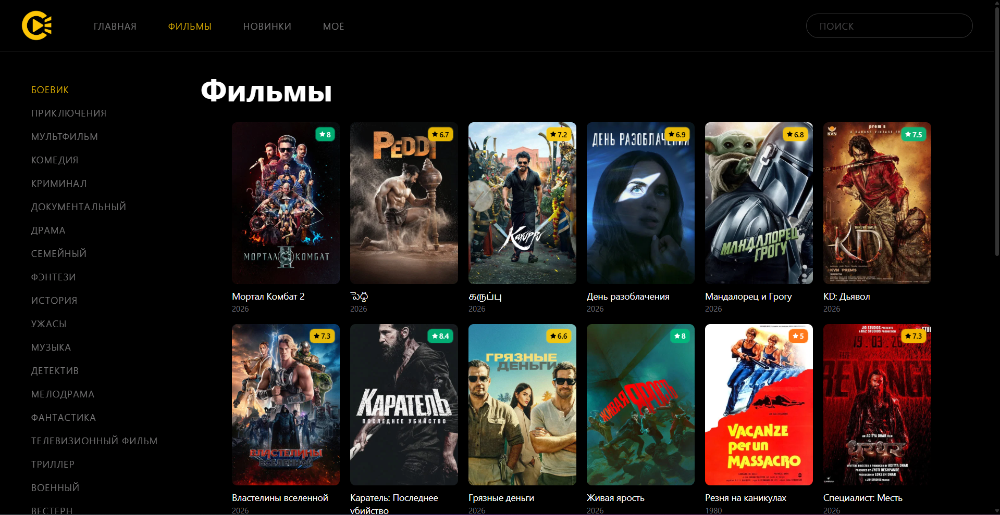
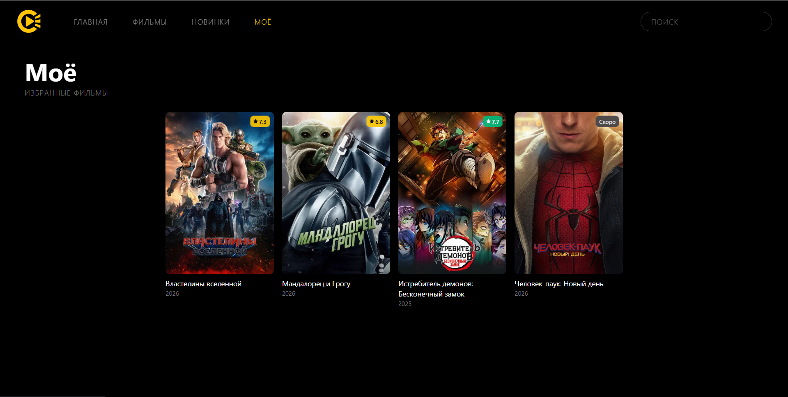
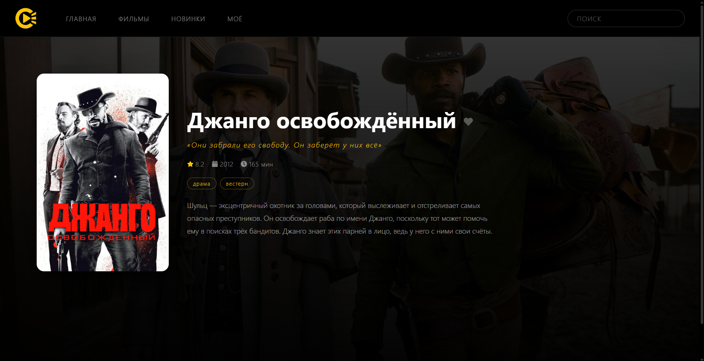

# 🎬 Cineya — кинопоиск на React

**Современное SPA-приложение для поиска и просмотра информации о фильмах с адаптивным дизайном.**

[🚀 Демо](https://cineya.vercel.app/) • [📦 Репозиторий](https://github.com/qudzen/Cineya)

---

## ✨ Особенности

- 🔍 **Поиск фильмов** по названию через TMDB API
- 📱 **Адаптивный дизайн** с использованием TailwindCSS
- ⚡ **Быстрая загрузка** благодаря Vite
- 🎯 **TypeScript** для типобезопасности
- 🔄 **Кэширование и пагинация** запросов через TanStack Query
- 🔐 **Вход в аккаунт** через Яндекс ID (OAuth 2.0)
- ❤️ **Сохранение избранных фильмов** в `localStorage`

---

## 🛠️ Технологии

| Технология | Назначение |
|------------|-----------|
| **React 18** | Библиотека для построения UI |
| **TypeScript** | Типизация JavaScript |
| **Vite** | Сборка и разработка |
| **TailwindCSS** | Стилизация и адаптивность |
| **TanStack Query** | Запросы, кэширование и пагинация |

| **TMDB API** | Источник данных о фильмах |

## 📸 Скриншоты

---
